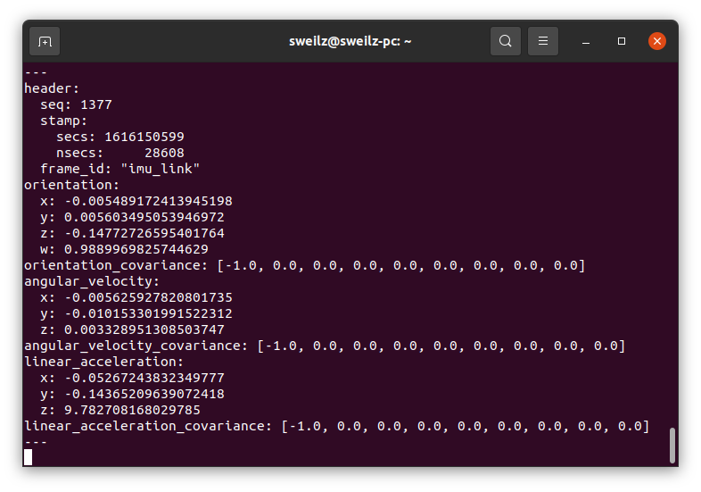

# Genisys IMU

Genisys คือโมดูล IMU 9DoF ผลิตโดย Anman ที่สามารถให้ค่าของ Orientaion ออกมาโดยใช้ Digital Motion Processor (DMP) ของตัวชิปเป็นของ TDK InvenSense ICM-20948

| ข้อมูลเซนเซอร์   | รายละเอียด |
| :-----------: | :-----------: |
| IMU Chip  | ICM-20948  |
| MCU Chip  | STM32F401  |
| Hardware Interface  | USB port และ TTL serial port |
| Data Output | Accelerate/Angular velocity/Mannetic field/Quaternion |
| Angular accuracy | X,Y Axis 0.05° (static) / 0.1° (dynamic) |
| Accelerate accuracy | 0.02g |
| Gyro accuracy | 0.06°/s |
| Data frequent | ~56Hz (IMU data) ~56Hz(Magnetic field) |


ข้อมูลที่ส่งออกมาจะมี:	
* Orientation, Accelerometer และ Gyroscope (sensor_msgs/Imu) ~56Hz: `/imu/data`
* Magnetometer (sensor_msgs/MagneticField) ~56Hz: `/imu/mag`
* Euler angle (geometry_msgs/Vector3) ~56Hz: `/imu/euler`

## วิธีการ build แพ็กเกจ genisys_imu

1) clone the repository to your catkin's workspace src folder and add udev rules

    ```
    $ cd ~/catkin_ws/src
    $ git clone https://github.com/AnmanTechnology/genisys_imu.git
    $ cd genisys_imu/
    $ sudo cp 99-genisys-imu.rules /etc/udev/rules.d/
    $ sudo udevadm control --reload-rules
    $ sudo udevadm trigger
	$ cd ~/catkin_ws/
	$ catkin build __or__ catkin_make
    ```
    
    
	เมื่อสำเร็จแล้วไม่เจอ Error

## วิธีการใช้งานบอร์ด Genisys Imu กับ ROS

1) เชื่อมต่อบอร์ด Genisys IMU กับคอมพิวเตอร์ผ่านสาย micro USB
    
    เมื่อเสียบแล้วจะมีไฟสถานะสีขึ้น

2) เช็คว่าคอมพิวเตอร์มองเห็นพอร์ต USB รึยังใช้คำสั่ง
    ```
    $ ls /dev/tty*
    ```
    
    จะเห็นว่ามีพอร์ตชื่อ `/dev/ttyACM0` ขึ้นมา บางครั้งอาจจะเป็น `/dev/ttyACM1`

3) จากนั้นเปิด terminal ขึ้นมาแล้วใช้คำสั่ง
    ```
    $ roslaunch genisys_imu bringup.launch
    ```
    
    หากต้องการกำหนด port เป็นชื่ออื่นเช่น `/dev/ttyACM1` หรือ `/dev/Imu` (ปกติเป็น `/dev/ttyACM0`)
    ```
    $ roslaunch genisys_imu bringup.launch port:=/dev/Imu
    ```
    

4) ทดสอบอ่านค่าจาก topic
    สำหรับบอร์ด Genisys เมื่อรันแล้วจะมี topic ออกมาอยู่ 3 ตัวคือ
    * /imu/data เป็นค่าของ Orientation, Accel, Gyro ชนิด sensor_msgs/Imu
    * /imu/mag เป็นค่าของ Magnetic field ชนิด sensor_msgs/MagneticField
    * /imu/euler เป็นค่าของ Euler angle ชนิด geometry_msgs/Vector3

    ```
    $ rostopic list
    ```
    

    อ่านค่าจาก `/imu/data` ซึ่งมีความถี่ประมาณ 56Hz
    ```
    $ rostopic echo /imu/data
    ```
    
    
    

    อ่านค่าจาก `/imu/mag` ซึ่งมีความถี่ประมาณ 56Hz
    ```
    $ rostopic echo /imu/mag
    ```
    
    

5) ทดสอบแสดงผลใน RViz
    ```
    $ roslaunch genisys_imu display.launch
    ```
    
    
    
    